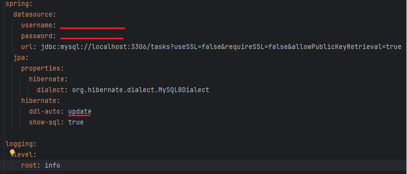

# taskmanagementsystem

## Инструкция запуска и работы программы
### Заполнение application.yml
#### Подключение MySQL 8
1. Ввести порт
2. Ввести имя пользователя
3. Ввести пароль
4. Указать параметр "create", для первого запуска, для последующих запусков программы потребуется изменить параметр на "update"
#### Заполнение раздела, со списком сайтов для индексации

# Не большой коментарий к выполненому тестовому заданию:
1. Из за загруженности на текущем рабочем месте не выполнил некоторые пункты(не хватило времени):
   - Doсker - не использовал.
   - Дополнительные инструменты к примеру КЭШ.
2. Так же можно было бы использовать валидацию ввода данных.
3. В целом некоторые моменты получились скомканными, к примеру контроллеры.
4. Не в полном обьемы выполнены тесты.
